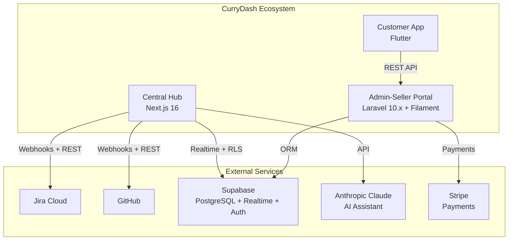

# CurryDash Ecosystem Documentation

Welcome to the CurryDash technical documentation. This site covers all three platform components
and is the single source of truth for architecture, API contracts, and development guides.

## Platform Components

<Cards>
  <Card title="Central Hub" href="/docs/central-hub" description="Next.js 16 monitoring dashboard — RBAC, webhooks, AI assistant, integrations." icon="Monitor" />
  <Card title="Admin-Seller Portal" href="/docs/admin-seller-portal" description="Laravel 10.x admin dashboard and Filament vendor portal." icon="LayoutDashboard" />
  <Card title="Customer App" href="/docs/customer-app" description="Flutter cross-platform app for iOS, Android, and Web." icon="Smartphone" />
  <Card title="Integrations" href="/docs/integrations" description="Cross-system data flows, webhook architecture, and API contracts." icon="Plug" />
</Cards>

## Ecosystem Architecture

## Quick Navigation by Role

<Cards>
  <Card title="Admin / PM" href="/docs/roles/admin" description="System administration, user management, integration setup." />
  <Card title="Developer" href="/docs/roles/developer" description="Architecture decisions, code patterns, PR and CI workflow." />
  <Card title="QA Engineer" href="/docs/roles/qa" description="Testing strategy, bug tracking, quality metrics." />
  <Card title="Stakeholder" href="/docs/roles/stakeholder" description="Dashboard reading, reports, and business metrics." />
</Cards>

## Getting Started

Start with the [Architecture Overview](/docs/getting-started/architecture-overview) to understand
how the three platform components interact, then choose the section most relevant to your role.
